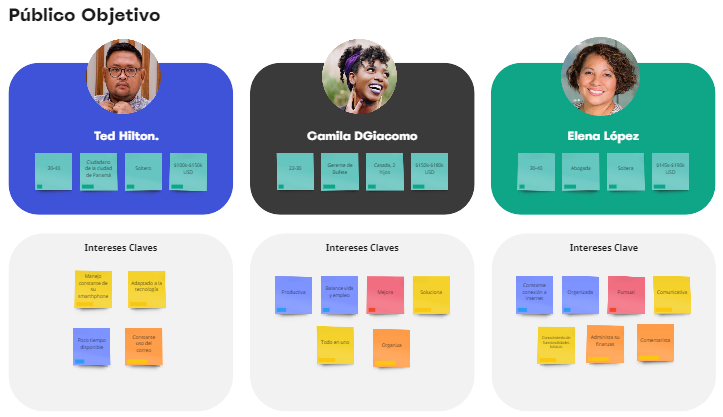

#  Aboga Bot :robot:
 Página Web para la automatización de demandas de un bufete de abogados.  
    
  Necesidades:
- Es un despacho de abogados que quiere automatizar las demandas de sus clientes, esto lo harán a traves de una página web llenando un formulario.
- Al momento de llenar el formulario se manda al proceso de pago para finalizar la transacción.
- Para dar seguimiento a su demanda, el cliente crea una cuenta en la plataforma y verá el seguimiento de cada una de las actualizaciones del proceso legal.
- El administrador del sitio recbe la notificación de una nueva demanda y con los datos llenados del formulario se crea automaticamente el documento legal en formato word para empezar el proceso.
- El administrador recibe el pago y debe de ser capaz de verlo en un dashboard para ver la cantidad de ingresos recibidos.
- El administrador actualiza el proceso de la demanda y agrega comentarios en cada paso del proceso.
- Al usuario le llegan correos de notificación para saber el avance de su proceso.
- La página debe de ser responsive para poderla ver desde el celular.
- La preferencia de colores del cliente es azul marino y blanco, pero acepta propuestas.

  # Toma de requerimientos - Aboga Bot :robot:
  Descripción General del Requerimiento
  - Nombre del proyecto: Aboga Bot
  - Descripción del Solicitante:
    - Usuario Solicitante: Como representante de una firma de abogados, planteo la necesidad actual de automatizar nuestros procesos de atención al cliente, en cuanto a la solitud de apertura de un nuevo caso, como también el brindar un seguimiento continuo en el que dicho cliente y el abogado representante puedan tener la información a la mano y actulizada. Permitiendo a su vez, a nuestro personal tener un control de cada uno de los casos y pagos que maneja de manera personal. Para ello, requerimos de un sistema capaz de cubrir con cada una de estas necesidades, haciendo uso de tecnologías que pueda agilizar los procesos mencionados. 
    - Lider Funcional: El solicitante nos plantea la necesidad de adquirir una página web que permita al usuario aperturar una demanda desde cualquier dispositivo con conexión a internet, en el cual a través de un formulario pueda adjuntar los datos pertinentes para que el abogado asignado pueda dar inicio a dicho proceso. Cada uno de los abogados contará con un apartado exclusivo en la página web para poder visualizar y gestionar de manera ágil la información de sus clientes, a su vez tener control de los pagos recibidos, brindar actualización en tiempo real de los procesos de cada uno de los casos. Para matener esta información almacenada de manera segura, requerirá la conexión de una base de datos la cual será unicamente manejada por un administrador de manera que se mantenga la integridad de dicha información.
  - Modelamiento del Negocio
  - Términos de Referencia
     - Alcance de la solución: Este proyecto está diseñado para proporcionar la automatización de los procesos diarios de un bufete de abogados, el sistema les permitirá a los clientes y abodgados los siguiente:
       - Iniciar sesión e identificarse en el sistema.
       - Registrar el caso que requiere aperturar.
       - Acceso a las actualizaciones de los procesos judiciales.
       - Acceso a una interfaz de comunicación cliente-abogado.
       - Capacidad de administrar los ingresos personales generados.
       - Visualizar información de clientes personales.
       - Visualizar historial de casos personales.
       - Administrar el contenido de cada expediente de los cuales es encargado.
       - Visualizar las estadisticas personales registradas.  
     - Requerimientos Funcionales:
       - Registrar Casos.
       - Autenticación y Autorización.
       - Actualización de Procesos.
       - Gestión de Pagos.
       - Interfaz de Mensajería y Notificación. 
     - Requerimiento No Funcionales:
       - Toda funcionalidad del sistema debe responder al usuario en menos de 5 segundos.
       - El sistema debe poseer los colores azul marino y blanco, acorde a quien solicita el software.
       - Los datos modificados deben ser actualizados en la base de datos en un tiempo máximo de 5 segundos.
       - Las credenciales de inicio de sesión podrán ser cambiadas solo por el dueño de la cuenta.
       - Toda la comunicación de datos de usuario debe manejarse bajo encriptación.
       - El sistema debe poseer un diseño “responsive” a fin de garantizar una adecuada visualización desde cualquier dispositivo.
       - El sistema no revelará a terceros otros datos personales de los clientes distintos a los nombres de usuario.
     - Interesados en la Solución: 
       - Usuario Solicitante: Prevee una mejora en el ámbito laboral de su empresa, a través de un sistema modernizado capaz de automatizar procesos cotidianos.
       - Clientes: Obtener respuesta inmediata en cuanto a información de interés para sí, de manera fácil y sin complicaciones.
       - Abogados: Gestionar de mejor manera la información y el tiempo dedicado a resolver soluciones del oficio.
     - Precondiciones:   
       - Contar con las herramientas necesarias para dar inicio a la solución propuestas. 
       - Los usuarios tipo personal deberán disponer de acceso a internet de manera indefinida.
     - Requisitos Técnicos: 
       - Tipo de Servicio: Web y Móvil
       - Base de Datos: MySQL
       - Lenguaje: Javascript, PHP, HTML, CSS.
     - Viabilidad Técnica: No
   - Buyer Persona
   
   
  # Público Objetivo - Aboga Bot :robot:
  
  
  # Wireframe UX - Aboga Bot :robot:
 
 :paperclip:Link: https://balsamiq.cloud/sv6p4cw/pg0gzpq
  # Mockup UI - Aboga Bot :robot:
 
 
 
   
 :paperclip:Link: https://www.figma.com/file/ti5Vg6SG5gBZQSdlK8P3Yy/AbogaBot?node-id=0%3A1
 
Lenguajes y Herramientas utilizados:  

